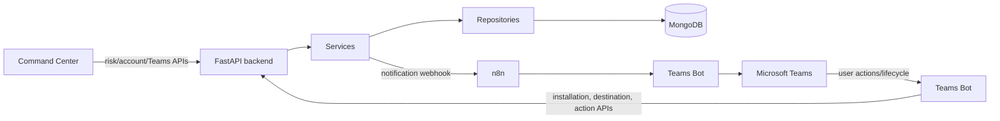

# System architecture

`app/main.py` creates the FastAPI application, installs correlation-ID and CORS middleware, registers exception handlers, and includes six routers. Lifespan startup connects to MongoDB, pings it, and reconciles indexes; failure prevents startup.

## Layer contracts

| Layer | Responsibility |
|---|---|
| Routers | HTTP paths, parameters, response serialization, dependency declaration |
| Dependencies | Account context, internal-key guard, construction graph |
| Services | Tenant/routing/business decisions and workflows |
| Repositories | All Motor/PyMongo operations |
| Schemas/models | Wire validation, projections, enums/constants |
| Infrastructure | Settings, Mongo lifecycle, middleware, logging, errors |

Dependencies create cheap repository/service instances per request while sharing the process-wide Motor client/database. The system is synchronous from the caller’s perspective: n8n is called before `send-to-teams` returns. There is no internal queue or worker.

## Tenant boundary

Risk repository operations always include `accountId`; account context currently comes from a query parameter or `X-Account-Id`, not authenticated claims. Teams action account ownership is resolved from an enabled Microsoft tenant mapping.
