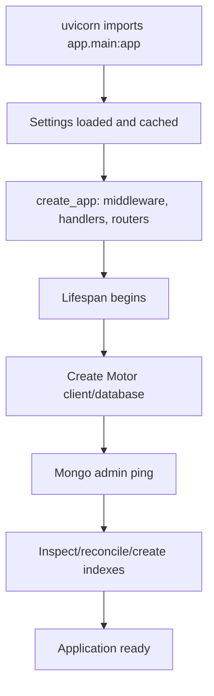

# Application flow

## Startup



The confirmed production entry point is `uvicorn app.main:app --host 0.0.0.0 --port 8000`. Shutdown closes the Motor client.

## Standard request lifecycle

```mermaid
sequenceDiagram
  participant C as Client
  participant MW as Middleware/FastAPI
  participant R as Router
  participant S as Service
  participant Repo as Repository
  participant DB as MongoDB
  C->>MW: HTTP request
  MW->>MW: assign correlation ID; CORS
  MW->>R: validated parameters/body
  R->>S: business operation
  S->>Repo: scoped persistence call
  Repo->>DB: Motor operation
  DB-->>Repo: document/result
  Repo-->>S: domain dict
  S-->>R: result or AppError
  R-->>C: response model; X-Correlation-ID
```

## Send-to-Teams workflow

`POST /api/risks/{riskId}/send-to-teams` resolves account context, loads the latest account-scoped risk, checks cached idempotency result, selects an explicit channel destination/installation or resolves `notificationRoute`, creates a pending `notification_logs` record, posts the payload to n8n, marks the log success/failure, stores a successful idempotency result, and returns an event ID. A failure after pending-log creation remains auditable as failed.

## Teams action workflow

`POST /api/risk-actions/execute` optionally checks the shared key, resolves `tenantId` to an enabled account, confirms the risk in that account, then dispatches to view-details, mitigation, tracking, or assignment behavior. Read actions return dynamic-card business data; mutation actions update MongoDB and return an acknowledgement.
