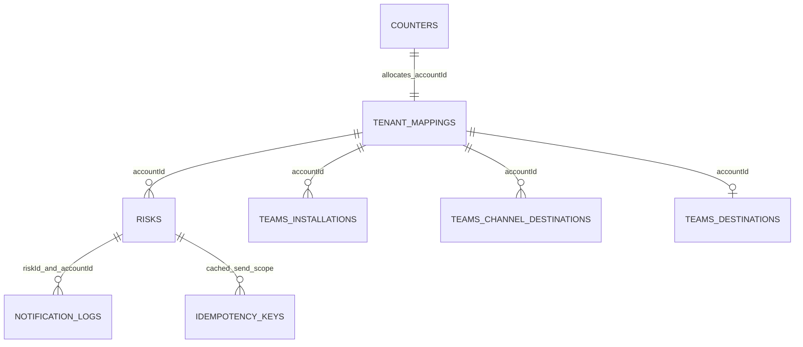

# Database design

MongoDB is accessed asynchronously through one lifespan-managed Motor client. Database defaults to `notifications_db`; startup pings Mongo and calls `create_indexes`. Repositories are the only persistence layer.

Relationships are application conventions, not MongoDB foreign keys.

## Collections

### `risks`

Fields: `_id`; `riskId`, `accountId`, optional `notificationRoute`; title/severity/status/summary; generic `entity`; `metrics`; `details.sections`; `mitigation.sections`; metadata/extensions; nested tracking and assignment; `createdAt`, `updatedAt`. Created/read/updated/deleted by `RiskRepository`; action mutations update nested tracking/assignment. Indexes: accountId; unique `(accountId,riskId)`; severity; status; createdAt. Legacy documents are normalized at read time and missing timestamps are persisted lazily.

### `tenant_mappings`

Fields: accountId, tenantId, clientName, enabled, createdAt, updatedAt. Used to establish tenant ownership and account display. Unique indexes on tenantId and accountId. Manual upsert or automatic provisioning creates records.

### `counters`

`{_id:"account_id", sequence:number}` supports atomic `ACC-NNN` allocation. No explicit index beyond MongoDB `_id`.

### `teams_installations`

Fields include account/tenant/team/channel/conversation/service URL, names, connected actor IDs/names, botAppId, routeKey, enabled, connected/disconnected/created/updated timestamps. Upserted on Teams lifecycle; never hard-deleted. Indexes: accountId; `(accountId,enabled,updatedAt desc)`; `(accountId,routeKey,enabled)`; unique active `(accountId,routeKey)` partial; unique account/tenant/team partial; unique account/tenant/conversation when team is null.

### `teams_channel_destinations`

Fields: account/tenant/team/channel/conversation/service URL, names, connectedByName, enabled and lifecycle timestamps. Unique `(accountId,tenantId,teamId,channelId)` plus account and `(accountId,enabled)` indexes. Team disconnect disables matching channels.

### `teams_destinations`

Legacy mapping fields: accountId, team/channel IDs and names, enabled, timestamps. Unique accountId. Current notification routing uses installation/channel destinations, not this collection.

### `notification_logs`

Fields: eventId, riskId, eventType, actionKey, accountId, teamId, channelId, status, n8nResponse, errorMessage, createdAt. Unique eventId plus riskId/status/eventType/createdAt indexes. Send flow transitions pending → success/failed; records are read-only through HTTP.

### `idempotency_keys`

Fields: key, scope (`send_to_teams:<accountId>`), result, createdAt. Unique `(key,scope)`. No TTL: results persist indefinitely.

## Observed inconsistency

`scripts/seed.py` creates a globally unique `risks.riskId` index, conflicting with startup’s multi-tenant compound unique index and its removal of `riskId_1`. Running the seed after startup can reintroduce the obsolete constraint.
