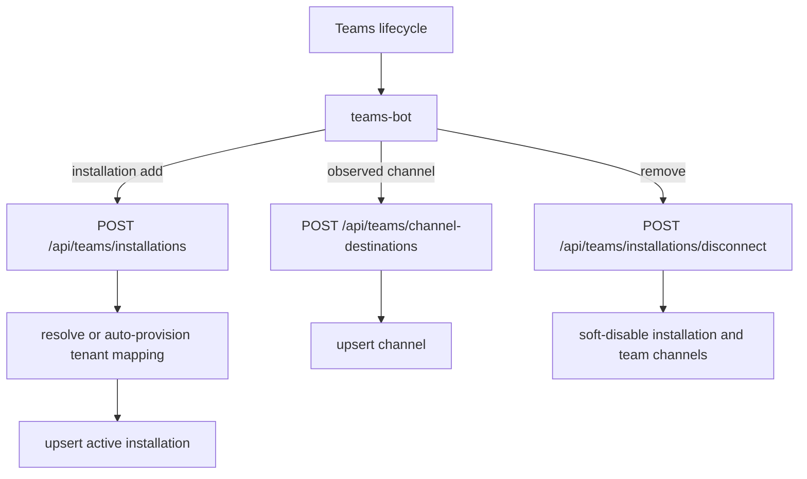

# Webhooks and events

## Outbound notification event

Trigger: `POST /api/risks/{riskId}/send-to-teams`. Entry point → `NotificationService.send_to_teams` → Mongo risk/destination/log/idempotency repositories → `N8nService.trigger_webhook` → n8n → external teams-bot. The payload contains `eventType: initial_notification`, `accountId`, a legacy ID-only `destination`, full `teamsDestination`, clean `notification`, and optional `requestedBy`.

Failure scenarios: missing/inactive/ambiguous route (404/409) before a log; n8n failure after pending log marks it failed and returns 502; successful idempotency keys replay the original API response without a second webhook.

## Inbound Teams lifecycle events

The HTTP requests are generated by teams-bot, not Teams directly:

## Inbound action event

teams-bot/n8n calls `/api/risk-actions/execute` with risk, tenant, action and actor/assignment payload. The backend resolves tenant ownership, reads or mutates the risk, and returns business data/acknowledgement. It does not push the action result to n8n itself.

## Internal application events

Notification logs are state records rather than an event bus. There are no background events, callbacks, scheduled jobs, database change streams, queues, retries, or dead-letter processing.
