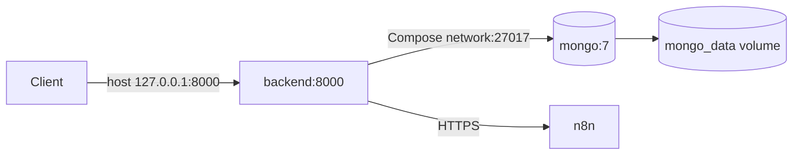

# Deployment and infrastructure

## Container topology

| Service | Port | Exposure | Purpose |
|---|---:|---|---|
| backend | 8000 | Loopback host mapping in Compose | FastAPI/Uvicorn |
| mongo | 27017 | Internal Compose network only | Persistence |
| n8n | HTTPS/remote | External | Notification workflow |

The backend image uses `python:3.12-slim`, exact requirements, non-root UID 1000, and one Uvicorn process. Compose waits for Mongo’s ping healthcheck and restarts both services unless stopped. Mongo data persists in a named volume. The backend container has no healthcheck.

No reverse proxy, TLS termination, Kubernetes/cloud manifest, CI/CD, backup/restore job, migration runner, metrics collector, or secret manager is present. Production ingress, certificates, registry, release/rollback procedure, replica topology, and Mongo authentication/replication are not confirmed.

Startup index reconciliation can block deployment when duplicate account/risk or tenant/account data prevents unique constraints. Review database state and logs before rollback; do not delete duplicates automatically.
